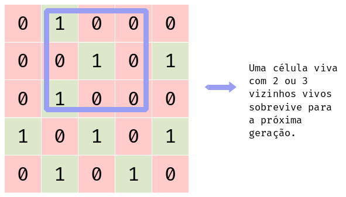
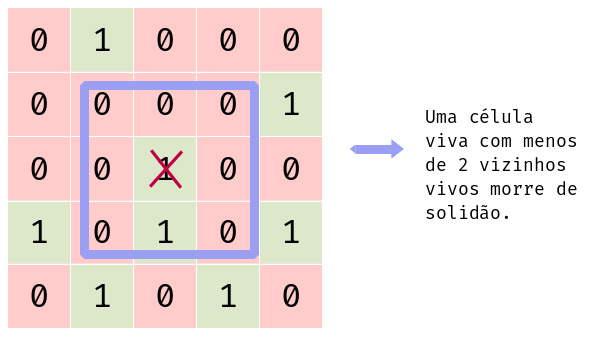
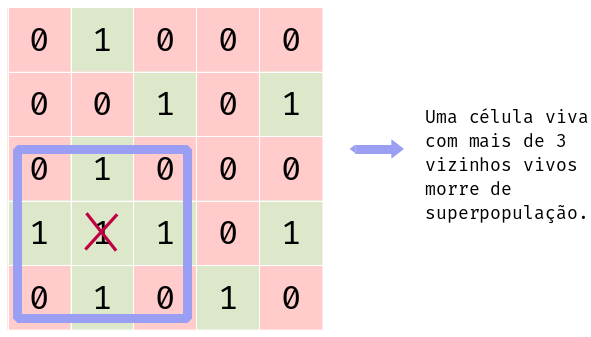
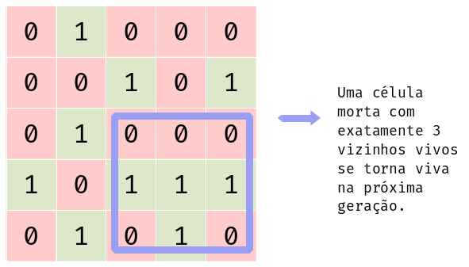
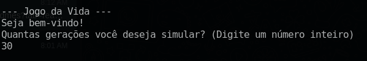

#  🎮 Jogo da Vida em C++

<div align="center">
   
   
   
   
</div>

<details>
  <summary>📌 Tópicos</summary>
    <ol>
        <li><a href="#descricao">Descrição</a></li>
        <li><a href="#funcionalidades">Funcionalidades</a></li>
        <li><a href="#implementacao-do-jogo-da-vida">Implementação do Jogo da Vida</a></li>
        <li><a href="#estrutura-de-diretorios">Estrutura de Diretórios</a></li>
        <li><a href="#como-usar">Como Usar</a></li>
        <li><a href="#exemplos">Exemplos</a></li>
        <li><a href="#makefile">MakeFile</a></li>
        <li><a href="#contato">Contato</a></li>
    </ol>
</details>

## 📝 Descrição

Este é um programa em C++ que implementa o famoso "Jogo da Vida" de Conway. O Jogo da Vida é um autômato celular desenvolvido pelo matemático britânico John Horton Conway em 1970. Ele é um jogo de "zero jogadores", o que significa que sua evolução é determinada por seu estado inicial, não exigindo mais nenhuma entrada do usuário. O jogo se desenrola em uma grade bidimensional de células, cada uma das quais pode estar viva ou morta. As regras para a evolução das células são simples e se baseiam em:

1. **SOBREVIVÊNCIA**:  


2. **MORTE POR SOLIDÃO**:   


3. **MORTE POR SUPERPOPULÇÃO**:   


4. **Reprodução**:   


Este programa em C++ permite que você forneça uma configuração inicial de células vivas e observe como elas evoluem ao longo do tempo, seguindo as regras do Jogo da Vida.

## ⚙️ Funcionalidades
O programa oferece diversas funcionalidades para interagir com o Jogo da Vida e analisar suas gerações. Aqui estão as principais:

1. **Leitura de Configuração Inicial**: O programa permite ao usuário fornecer uma configuração inicial do jogo por meio do arquivo de entrada `input.mps`, disponível na pasta `/datasets`. Isso oferece flexibilidade para experimentar diferentes padrões e configurações.

2. **Geração de Gerações**: O programa solicita ao usuário a quantidade de gerações a serem geradas. Isso é feito por meio da função `pedirNumeroGeracoes`, como mostrado no trecho de código abaixo:
   ```cpp
   void pedirNumeroGeracoes(int& qntGeracoes) {
        system("clear");
        std::cout << "--- Jogo da Vida ---\n";
        std::cout << "Seja bem-vindo! \nQuantas gerações você deseja simular? (Digite um número inteiro)\n";
        std::cin >> qntGeracoes;
        std::cout << "\nIniciando simulação do Jogo da Vida com " << qntGeracoes << " gerações...\n--------" << std::endl;
    }
   ```
    

3. **Aplicação das Regras do Jogo**: Implementa as regras clássicas do Jogo da Vida de acordo com as especificações. As regras são aplicadas de forma eficiente para determinar o estado de cada célula em cada geração. Detalhes específicos sobre como as regras são aplicadas serão explicados na seção de implementação abaixo.

4. **Saída de Resultados**: Após a geração das gerações desejadas, o programa salva os resultados no arquivo `geracoes.mps` na pasta `/datasets`. Isso permite que o usuário analise as gerações geradas fora do programa, se necessário.

## 🛠️ Implementação do Jogo da Vida
O programa implementa o Jogo da Vida seguindo as regras clássicas estabelecidas. Aqui está uma visão geral de como isso é feito:

1. **Leitura da Configuração Inicial**: O programa lê uma matriz representando a configuração inicial do jogo a partir de um arquivo fornecido pelo usuário. A matriz pode conter células vivas (representadas pelo valor 1) e células mortas (representadas pelo valor 0). (Veja a função `lerMatriz` no arquivo `jogoDaVida.cpp`).

2. **Verificação da Matriz**: Após a leitura da matriz, o programa verifica se ela está em formato 2 para 1, ou seja, se há pelo menos o dobro de células mortas do que células vivas. Isso garante que a matriz inicial tenha uma distribuição razoável de células vivas e mortas para evitar padrões estáticos. (Veja a parte de verificação da matriz na função `verificarFormatoMatriz` no arquivo `jogoDaVida.cpp`).
    ```cpp
    bool verificarFormatoMatriz(int **matriz, int linhas, int colunas) {
        int contador1 = 0;\n--------
        int contador0 = 0;
        for (int i = 0; i < linhas; ++i) {
            for (int j = 0; j < colunas; ++j) {
                if (matriz[i][j] == 1) {
                    contador1++;
                } else {
                    contador0++;
                }
            }
        } 

        // A cada 2 0s, tem que ter 1 1
        if ((contador0/2) <= contador1) {
            return false;
        } else {
            return true;
        }
    }
    ```

3. **Geração de Novas Gerações**: O programa gera várias gerações do jogo da vida com base na configuração inicial lida. Ele segue as regras do jogo para determinar o estado de cada célula em cada geração. A análise e aplicação das regras do jogo ocorrem da seguinte maneira:
   - **Análise dos Vizinhos**: Para cada célula na matriz, o programa verifica o estado de seus vizinhos para determinar quantos estão vivos. O trecho de código abaixo realiza essa análise:
     ```cpp
     for (int i = 0; i < linhas; ++i) {
        for (int j = 0; j < colunas; ++j) {
            // Verificar a quantidade de vizinhos de cada célula
            int vizinhos = 0;
            if (i > 0 && j > 0 && matriz[i-1][j-1] == 1) {
                // Vizinho superior esquerdo
                vizinhos++;
            }
            if (i > 0 && matriz[i-1][j] == 1) {
                // Vizinho superior
                vizinhos++;
            }
            if (i > 0 && j < colunas-1 && matriz[i-1][j+1] == 1) {
               // Vizinho superior direito
                vizinhos++;
            }
            if (j > 0 && matriz[i][j-1] == 1) {
                // Vizinho esquerdo
                vizinhos++;
            }
            if (j < colunas-1 && matriz[i][j+1] == 1) {
                // Vizinho direito
                vizinhos++;
            }
            if (i < linhas-1 && j > 0 && matriz[i+1][j-1] == 1) {
               // Vizinho inferior esquerdo
                vizinhos++;
            }
            if (i < linhas-1 && matriz[i+1][j] == 1) {
                // Vizinho inferior
                vizinhos++;
            }
            if (i < linhas-1 && j < colunas-1 && matriz[i+1][j+1] == 1) {
                // Vizinho inferior direito
                vizinhos++;
            }
     }
     ```

   - **Aplicação das Regras**: Com base no número de vizinhos vivos, o programa decide o estado da célula na próxima geração, seguindo as regras do Jogo da Vida. Abaixo estão os trechos de código que implementam as regras do jogo:
      - **Sobrevivência**: Uma célula viva com 2 ou 3 vizinhos vivos sobrevive para a próxima geração.
        ```cpp
            if (matriz[i][j] == 1) { 
                if (vizinhos == 2 || vizinhos == 3) {
                    matrizNova[i][j] = 1;
                }
            }
        ```
      - **Morte por Solidão e Morte por Superpopulação**:Uma célula viva com menos de 2 vizinhos vivos morre de solidão e uma célula viva com mais de 3 vizinhos vivos morre de superpopulação. 
        ```cpp
            if (matriz[i][j] == 1) { 
                else if (vizinhos < 2 || vizinhos > 3) {
                    // se tiver menos de 2 morre por solidão e 
                    //se tiver mais de 3 morre por superpopulação
                    matrizNova[i][j] = 0;
                }
            }
        ```
      - **Reprodução**: Uma célula morta com exatamente 3 vizinhos vivos se torna viva na próxima geração.
        ```cpp
            if (matriz[i][j] == 1) { 
                if (vizinhos == 3) {
                    matrizNova[i][j] = 1;
                }
            }
        ```

   - **Atualização da Matriz**: O programa gera uma nova matriz com base nos estados das células da geração atual. (Veja a função `gerarProximaMatriz` no arquivo `jogoDaVida.cpp`).

4. **Saída dos Resultados**: Após a geração de todas as gerações desejadas, o programa salva os resultados em um arquivo de saída chamado `geracoes.mps`. Cada geração é representada como uma matriz de 0s e 1s, onde 0 representa uma célula morta e 1 representa uma célula viva. (Veja a parte de escrita no arquivo `geracoes.mps` na função `gerarProximaMatriz` no arquivo `jogoDaVida.cpp`).

Essa é uma visão geral detalhada de como o programa implementa o Jogo da Vida. Para detalhes técnicos mais específicos, consulte o código-fonte fornecido.

## 📂 Estrutura de Diretórios

O programa segue uma estrutura de diretórios bem definida para organizar seus arquivos e recursos. 

```.
|
├── build
│   │   ├── objects
│   │   |   ├── src
│   │   |   |   ├── jogoDaVida.o
│   │   |   |   └── main.o
│   │   |   └── app
├── datasets
│   │   ├── geracoes.mps
│   │   └── input.mps
├── src
│   │   ├── jogoDaVida.cpp
│   │   ├── jogoDaVida.Hpp
│   │   └── main.cpp
├── makefile
└── README.md
```

## 📚 Como Usar

1. Clone este repositório:

    ```bash
    git clone https://github.com/dudatsouza/jogoDaVida.git

2. Antes de compilar o programa, é recomendado executar o comando `make clean` para garantir que todos os arquivos compilados anteriores sejam removidos:

    ```bash
    make clean
    ```

3. Em seguida, compile o programa usando o Makefile:

    ```bash
    make
    ```

4. Execute o programa, fornecendo o nome do arquivo de entrada:

    ```bash
    make run 
    ```

5. Siga as instruções para inserir a quantidade de gerações desejada.

6. Os resultados serão salvos no arquivo `geracoes.mps`.

## 📋 Exemplos
Aqui está uma amostra de parte do arquivo `input.mps`, que contém a matriz inicial que será analisada:
```
    0 1 0 0 0 1 0 0
    0 0 1 0 1 0 1 0
    0 1 0 0 0 0 0 1
    1 0 1 0 1 0 1 0
    0 1 0 1 0 0 0 0
    0 0 1 0 1 0 0 0
```

Após o programa ler a matriz, será solicitado ao usuário o número de gerações. Simulando que o usuário digitou `5`, será colocado no arquivo de saída `gerações.mps` os resultados das gerações. Um exemplo abaixo: 
```
    0 1 0 0 0 1 0 0 
    0 0 1 0 1 0 1 0 
    0 1 0 0 0 0 0 1 
    1 0 1 0 1 0 1 0 
    0 1 0 1 0 0 0 0 
    0 0 1 0 1 0 0 0 

    0 0 0 0 0 1 0 0 
    0 1 1 0 0 1 1 0 
    0 1 1 0 0 0 1 1 
    1 0 1 1 0 0 0 0 
    0 1 0 0 1 1 0 0 
    0 0 1 1 0 0 0 0 

    0 0 0 0 0 1 1 0 
    0 1 1 0 0 1 0 1 
    1 0 0 0 0 1 1 1 
    1 0 0 1 1 1 1 0 
    0 1 0 0 1 0 0 0 
    0 0 1 1 1 0 0 0 

    0 0 0 0 0 1 1 0 
    0 1 0 0 1 0 0 1 
    1 0 1 1 0 0 0 1 
    1 1 0 1 0 0 0 1 
    0 1 0 0 0 0 0 0 
    0 0 1 1 1 0 0 0 

    0 0 0 0 0 1 1 0 
    0 1 1 1 1 1 0 1 
    1 0 0 1 1 0 1 1 
    1 0 0 1 0 0 0 0 
    1 1 0 0 1 0 0 0 
    0 0 1 1 0 0 0 0 

    0 0 1 1 0 1 1 0 
    0 1 1 0 0 0 0 1 
    1 0 0 0 0 0 1 1 
    1 0 1 1 0 1 0 0 
    1 1 0 0 1 0 0 0 
    0 1 1 1 0 0 0 0 
```

A primeira matriz do arquivo é a matriz de entrada, e logo em seguida são as 5 matrizes que foram geradas.


## ⛏ Makefile

O Makefile é um utilitário que automatiza o processo de compilação e execução de programas. Aqui estão os principais comandos do Makefile para este projeto:

| Comando      | Descrição                               |
|--------------|-----------------------------------------|
| `make`       | Compila o programa.                     |
| `make run`   | Executa o programa com o arquivo de entrada fornecido. |
| `make clean` | Remove os arquivos compilados.          |

## 📧 Contato

Para mais informações ou sugestões, sinta-se à vontade para entrar em contato:

- ✉️ **E-mail**: [](mailto:dudateixeirasouza@gmail.com)
- 💼 **LinkedIn**: [](https://www.linkedin.com/in/maria-eduarda-teixeira-souza-2a2b3a254/)
- 📸 **Instagram**: [](https://www.instagram.com/dudat_18/)

Ficarei feliz em receber feedbacks, contribuições ou responder a quaisquer dúvidas que você possa ter sobre o programa. 
